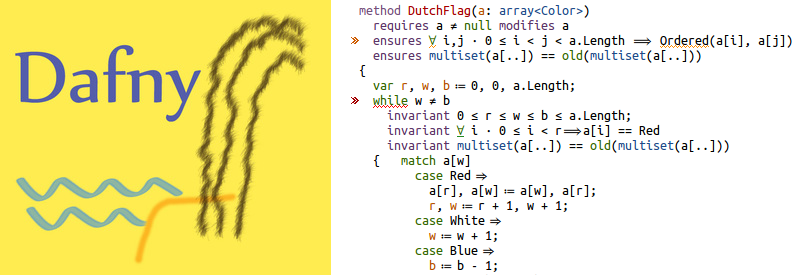

Dafny is a programming language with a program verifier. As you type in your program, the verifier constantly looks over your shoulders and flags any errors. Dafny is currently spread across 3 sites:

* [Dafny's homepage](http://research.microsoft.com/dafny), which contains some information about Dafny.
* This site, which includes sources, [binary downloads](https://github.com/Microsoft/dafny/releases) for Windows, Mac, GNU/Linux, and FreeBSD, sources, and the issue tracker (old issues are on [codeplex](https://dafny.codeplex.com/workitem/list/basic)).
* The [Rise4fun site](http://rise4fun.com/dafny), where you can verify Dafny programs in your web browser.

# Try Dafny

The easiest way to get started with Dafny is to use [rise4fun](http://rise4fun.com/dafny), where you can write and verify Dafny programs without having install anything. On rise4fun, you will also find the online Dafny tutorial.

# Setup

See [installation instructions](https://github.com/Microsoft/dafny/wiki/INSTALL) on the wiki
and instructions for installing the [Dafny mode for Emacs](https://github.com/boogie-org/boogie-friends).

# Read more

Here are some ways to get started with Dafny:

* [Online tutorial](http://rise4fun.com/Dafny/tutorial/guide), focusing mostly on simple imperative programs 
* [3-page tutorial notes](http://research.microsoft.com/en-us/um/people/leino/papers/krml233.pdf) with examples (ICSE 2013) 
* Dafny [Quick Reference](http://research.microsoft.com/en-us/projects/dafny/reference.aspx)
* Language reference for the [Dafny type system](http://research.microsoft.com/en-us/um/people/leino/papers/krml243.html), which also describes available expressions for each type 
* [Cheatsheet](https://docs.google.com/document/d/1kz5_yqzhrEyXII96eCF1YoHZhnb_6dzv-K3u79bMMis/edit?pref=2&pli=1): basic Dafny syntax on two pages 
* Dafny Reference Manual [[html](https://github.com/Microsoft/dafny/Docs/DafnyRef/out/DafnyRef.html)] [[pdf](https://github.com/Microsoft/dafny/blob/master/Docs/DafnyRef/out/DafnyRef.pdf)]
* Videos at [Verification Corner](https://www.youtube.com/channel/UCP2eLEql4tROYmIYm5mA27A)
* For more papers on Dafny, see the Dafny section of Rustan Leino's [paper page](http://research.microsoft.com/en-us/um/people/leino/papers.html)

The language itself draws pieces of influence from:

* Euclid (from the mindset of a designing a language whose programs are to be verified),
* Eiffel (like the built-in contract features),
* CLU (like its iterators, and inpiration for the out-parameter syntax),
* Java, C#, and Scala (like the classes and traits, and syntax for functions),
* ML (like the module system, and its functions and inductive datatypes), and
* Coq and VeriFast (like the ability to include co-inductive datatypes and being able to write inductive and co-inductive proofs).

# External contributions

* [Haskell-to-Dafny translator](http://www.doc.ic.ac.uk/~dcw/h2d.cgi), by Duncan White
* [Vim-loves-Dafny mode](https://github.com/mlr-msft/vim-loves-dafny) for vim, by Michael Lowell Roberts
* [Boogie-Friends Emacs mode](https://github.com/boogie-org/boogie-friends)

# Code of Conduct

This project has adopted the [Microsoft Open Source Code of Conduct](https://opensource.microsoft.com/codeofconduct/). For more information see the [Code of Conduct FAQ](https://opensource.microsoft.com/codeofconduct/faq/) or contact [opencode@microsoft.com](mailto:opencode@microsoft.com) with any additional questions or comments.
